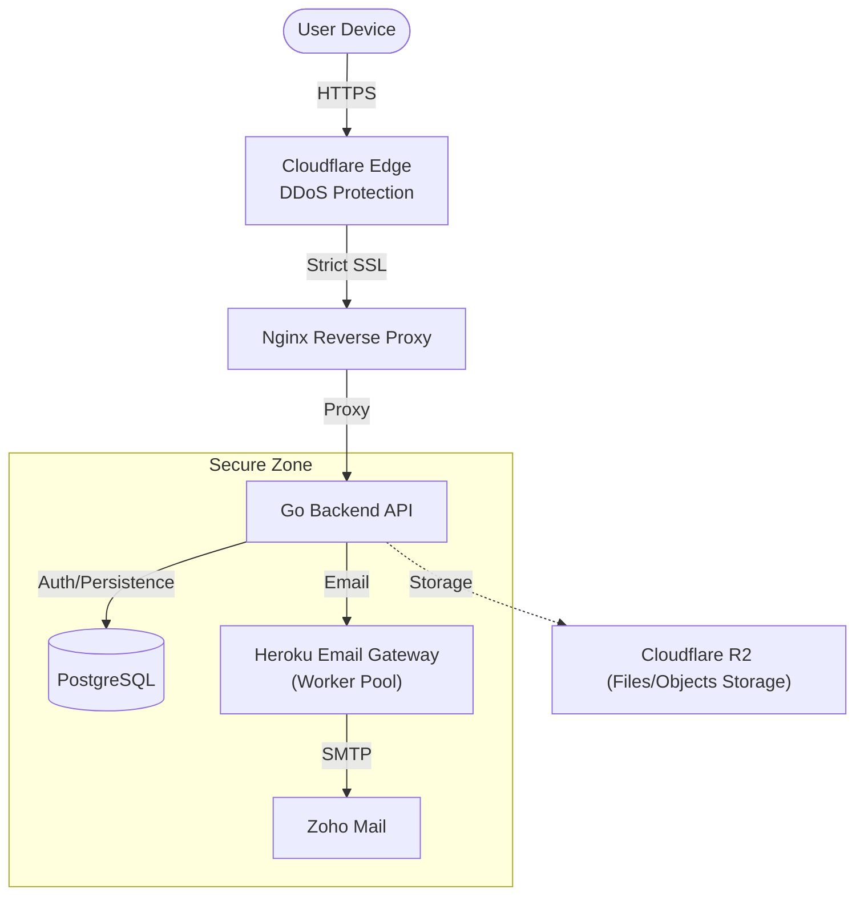

# Chatbasket Backend


> **A simplified yet highly secure production-grade backend for the Chatbasket application.**
>
> **View Live Deployment:** [https://chatbasket.live](https://chatbasket.live)

## 🚀 Overview

Chatbasket Backend is the high-performance foundation for a **privacy-first social platform**, designed to solve the engineering challenge of balancing **Public Discovery** with **Private Security**.

It acts as a **strict privacy enforcement engine** that bridges the gap between open user profiling and encrypted, isolated personal networks. By leveraging Go's concurrency models, it delivers a seamless real-time experience without compromising the rigid security boundaries required for modern social interactions.

This project is built for **real-world production**—featuring custom security protections, aggressive DB connection pooling strategies, and a "Zero-Touch" deployment pipeline.

---

## 🏗️ System Architecture

The system operates as a **Secure Gateway** (BFF - Backend for Frontend), ensuring that the frontend never interacts directly with sensitive database layers or auth providers.

**[Frontend Repository (Expo Web + Native)](https://github.com/wpbasket/chatbasket)**



#### 1. Modular Domain-Driven Architecture
The system enforces a strict modular boundary design, utilizing a unidirectional dependency flow within each module.
- **Platform Layer**: Core infrastructure (logging, middleware, shared clients, routing) is centralized in an isolated Platform Layer, ensuring domain logic remains pure and decoupled from technical implementation details.
- **Domain Boundaries**: Modules are deeply isolated to enforce strict separation of concerns.
- **Module Intercommunication**: Isolated domains communicate securely via Provider Interfaces, explicit Service Calls, and Event Publishing, rather than direct cross-domain database JOINs.

#### 2. Secure Gateway Pattern
The Go API acts as a strict **Security Gateway**. It manages proprietary Authentication, Authorization, and Session Persistence directly via **PostgreSQL**. External services like **Cloudflare R2** (Storage) and the **Heroku Email Gateway** are abstracted away behind clean service interfaces, ensuring the core business logic remains independent and secure.

#### 3. Design Principles
- **Clean Dependency Injection**: Dependencies are explicitly injected at every architectural layer, ensuring highly testable, predictable, and modular code without relying on global state.
- **Strictly Typed Responses**: We avoid dynamic maps for API payloads. All responses are defined using strict Data Transfer Objects (DTOs), ensuring the frontend has a predictable contract.
- **Centralized Error Handling**: A unified error pipeline ensures that every failure is caught and translated into a consistent JSON structure with actionable codes, preventing internal system leaks.

#### 4. Social Systems & Chat Engine
The application implements an **Ephemeral Relay System** and a high-performance **End-to-End Encrypted Chat Engine** designed for privacy-centric, low-latency communication and seamless multi-device synchronization using a **Dual-Transport (WebSocket/REST) fallback** strategy.
- **E2E Encryption**: All messages are strictly end-to-end encrypted on the client side before transmission, ensuring the backend operates as a pure zero-knowledge relay.
- **Documentation**: All core architectural decisions regarding social mechanics and the real-time sync lifecycle are comprehensively maintained within the [docs/](./docs) folder.

---

## 🔐 Security Architecture

Security is not an afterthought; it is baked into the core application flow.

- **Native Custom Authentication**: A production-grade Auth system built directly into the Go core. 
    - **Authentication Methods**: Supports standard Email & OTP verification alongside **QR Code Login** for seamless multi-device access.
    - **Zero Dependencies**: No external Auth services used for login/signup.
    - Uses **Argon2id** for state-of-the-art password and OTP hashing.
    - **Session Persistence**: Managed in PostgreSQL for real-time session tracking and remote logout capability.
    - **Web Clients**: Automatically detects and validates `HttpOnly` Secure Cookies, preventing XSS attacks.

- **HMAC Peppering & Credential Binding**: Passwords are pre-processed through HMAC-SHA256 using a global secret pepper and the account identifier to cryptographically bind the credential specifically to the account before Argon2id hashing, preventing impersonation and strengthening defense-in-depth.

- **Encrypted Contact Storage**: Contact nicknames are encrypted at rest using **ChaCha20-Poly1305 (AEAD)**. It cryptographically binds the nickname to the account (via AAD) and uses unique nonces to prevent statistical pattern leakage across the database.

- **End-to-End Message Encryption**: All chat payloads (text and media) are mathematically sealed on the client devices. The Go backend only stores and routes opaque ciphertexts, ensuring true zero-knowledge message persistence.

- **Mandatory Two-Step Verification**: All sensitive entry points (Signup & Login) are enforced by a strict **2FA flow**. Users must verify ownership via OTP before receiving any session tokens.

- **Credential Hashing**: Sensitive One-Time Passwords (OTPs) are hashed using **Argon2id**, ensuring that even temporary credentials are stored securely.

---

## ☁️ Infrastructure & Reliability

The application operates on a secure cloud infrastructure designed for zero-trust security and high availability.

#### 1. System Resilience & Efficiency
- **Lite Fetch Strategy & Identity Resolving**: Utilizes optimized "Lite" fetches. The system fetches minimal relation IDs and delegates rich profile hydration to a dedicated Identity Resolver service.
- **Implicit Block Filtering (Anti-Joins)**: Query-level security is enforced with built-in Anti-Joins, guaranteeing blocked entities are filtered out at the database layer before reaching the service layer.
- **Advanced DB Connection Pooling**: The PostgreSQL pool is manually tuned with `MaxConnLifetimeJitter` and strict resource caps to prevent thundering herd issues.
- **Graceful Shutdown**: The server captures OS signals (`SIGTERM`) to finish in-flight requests and close DB connections cleanly, ensuring zero dropped requests during deployments.
- **Hybrid Rate Limiting**: Features **Cloudflare WAF** for edge-level DDoS mitigation, backed by an in-memory application limiter for granular endpoint protection.

#### 2. Zero Trust Network
- **Oracle VM**: Hosted on scalable compute instances for reliable performance.
- **Zero Trust Security Architecture**:
    1. **Strict SSL (Identity)**: Encrypted via a 15-year Cloudflare Origin Certificate to prevent Man-in-the-Middle attacks.
    2. **Mutual TLS (Access)**: Enforced **Authenticated Origin Pulls**, requiring Nginx to validate Cloudflare's cryptographic signature for every request.
    3. **IP Firewall (Perimeter)**: Nginx strictly whitelists official Cloudflare CIDR ranges and drops all direct traffic.
- **Reverse Proxy**: Nginx handles SSL termination and header sanitization before requests reach the Go application.

---

## 🛠️ Tech Stack

We choose tools that offer **Control** and **Predictability**.

| Component | Technology | Rationale (Why?) |
|-----------|------------|------------------|
| **Core Logic** |  | **The System Backbone**: Powers the **Secure Gateway**, **Clean Architecture**, and the resilient **Dual-Transport** chat engine. It leverages Go's native concurrency and the **coder/websocket** library to provide high-performance real-time synchronization alongside robust REST endpoints for fallbacks. |
| **API Framework** |  | **Highly Customizable & Fast**: Zero-allocation router that is highly customizable and significantly faster than Gin or Fiber in our benchmarks. |
| **Database** |  | **Primary Hub**: Handles all User Data, Custom Auth Sessions, and Relations with ACID compliance. |
| **Email Gateway** |  | **High Reliability**: A dedicated Go-based **HTTP-to-SMTP Gateway** featuring a **Worker Pool** and **Fire-and-Forget** asynchronous logic to bypass primary infrastructure port restrictions. |
| **Object Storage** |  | **Secure Media Storage**: Safely handles all media uploads and file storage. |
| **Edge Security** |  | **Zero Trust Gateway**: Acts as an mTLS firewall (Authenticated Origin Pulls) and enforces strict end-to-end encryption. |
| **CI/CD** |  | **Zero-Touch Deploy**: Commits to `main` automatically build and swap containers on both Heroku and Oracle VM. |

---

## 🔮 Future Roadmap

We are actively developing the following features:

- **Group Chats (Upcoming)**: Secure multi-user private chat environments.
- **Audio/Video Calls (Upcoming)**: End-to-end encrypted real-time media communication.
- **Public Groups (Upcoming)**: Discoverable communities with robust moderation tools.
- ** Cross-Platform Notifications (Upcoming)**:
    - **FCM Universal Integration**: Unified push delivery for Android & iOS.
    - **Dual-Payload Strategy**: Support for both System Alerts (`Notification`) and Silent Data Updates (`Data-Only`).


---

## 💻 Running the Project

#### Local Development (Standard)
The `main` package is located in `app/`.

```bash
# Clone and tidy
git clone https://github.com/wpbasket/chatbasket-backend
cd chatbasket-api
go mod tidy

# Run the server
go run ./app
```

#### Production Build (Docker)
You can test the container build locally:

```bash
# Build optimized image
docker build -t chatbasket-api .

# Run with local environment variables
docker run -p 8080:8080 --env-file .env chatbasket-api
```
