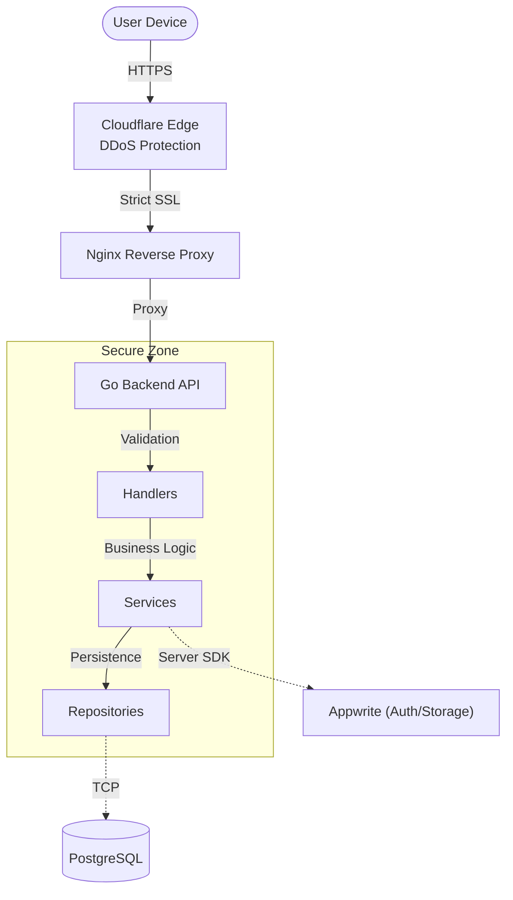

# Chatbasket Backend


[](https://chatbasket.live)

> **A simplified yet highly secure production-grade backend for the Chatbasket application.**

## 🚀 Overview

Chatbasket Backend is the high-performance foundation for a **privacy-first social platform**, designed to solve the engineering challenge of balancing **Public Discovery** with **Private Security**.

It acts as a **strict privacy enforcement engine** that bridges the gap between open user profiling and encrypted, isolated personal networks. By leveraging Go's concurrency models, it delivers a seamless real-time experience without compromising the rigid security boundaries required for modern social interactions.

Unlike standard boilerplate implementations, this project emphasizes **production readiness**—featuring bespoke cryptographic implementations, aggressive connection pooling strategies, and a "Zero-Touch" deployment pipeline.

---

## 🏗️ System Architecture

The system operates as a **Secure Gateway** (BFF - Backend for Frontend), ensuring that the frontend never interacts directly with sensitive database layers or auth providers.

**[Frontend Repository (Expo Web + Native)](https://github.com/wpbasket/chatbasket)**



### 1. Clean Architecture & Dependency Injection
The codebase enforces a strict unidirectional dependency flow (`Handler` -> `Service` -> `Repository`). 
- **Decoupling**: Services and Repositories are explicitly injected via factory functions (e.g., `NewUserHandler(service)`), making the system highly modular.
- **Testability**: This pattern allows for effortless mocking of dependencies during unit testing.

### 2. Secure Gateway Pattern
Crucially, **Appwrite** is used strictly as a backend infrastructure component via the Server API. The client (Expo) **never** holds API keys or talks to Appwrite directly. The Go API acts as the sole gatekeeper, enforcing business rules before any data persists.

---

## 📐 API Implementation Philosophy

We prioritize **consistency** and **type safety** over speed of development.

- **Strictly Typed Responses**: We avoid `map[string]interface{}`. All responses are defined in `model/` structs (e.g., `StatusOkay`, `ApiError`), ensuring the frontend has a predictable contract.
- **Standardized Error Handling**: A centralized error model (`model.ApiError`) ensures that every failure—whether validation, db, or auth—returns a consistent JSON structure with actionable codes.

---

## 🔐 Security Architecture

Security is not an afterthought; it is baked into the core application flow.

- **Dual-Strategy Authentication**: The middleware (`middleware/session.go`) implements a flexible hybrid system:
    - **Native Apps**: Accepts standard `Authorization: Bearer <session_id>:<user_id>` headers.
    - **Web Clients**: Automatically detects and validates `HttpOnly` Secure Cookies, preventing XSS attacks.
    
- **Mandatory Two-Step Verification**: All sensitive entry points (Signup & Login) are enforced by a strict **2FA flow**. Users must verify ownership via OTP before receiving any session tokens, preventing unauthorized account enumeration or access.

- **Credential Hashing**: Sensitive One-Time Passwords (OTPs) are hashed using **Argon2id**, ensuring that even temporary credentials are stored securely (memory-hardened against brute-force).

---

## ⚡ Performance & Reliability

### 1. Advanced Connection Pooling
Instead of default settings, the PostgreSQL connection pool (`db/pool.go`) is manually tuned for high concurrency:
- **Jitter & Lifetimes**: Configured `MaxConnLifetimeJitter` to prevent thundering herd problems during connection recycles.
- **Resource Caps**: Strict `MaxConns` limits to prevent database starvation under load.

### 2. Production Hardening
- **Graceful Shutdown**: The server captures OS signals (`SIGTERM`) to finish in-flight requests and close DB connections cleanly, ensuring zero dropped requests during deployments.
- **Rate Limiting**: An in-memory rate limiter protects public endpoints from abuse.

---

## ☁️ Infrastructure & Operations

The application operates on a hardened cloud infrastructure designed for zero-trust security:

- **DigitalOcean Droplet**: Hosted on scalable compute instances for reliable performance.
- **Cloudflare Full (Strict) SSL**: Traffic is end-to-end encrypted. We use **Cloudflare Origin Certificates** on Nginx to ensure that the origin server only communicates with Cloudflare, rejecting direct IP access.
- **Reverse Proxy**: Nginx `1.23` handles SSL termination and header sanitization before requests reach the Go application.

---

## 🛠️ Tech Stack

We choose tools that offer **Control** and **Predictability**.

| Component | Technology | Rationale (Why?) |
|-----------|------------|------------------|
| **Core Logic** | **Go (Golang)** | Chosen for its superior concurrency model (Goroutines) and compile-time type safety.
| **API Framework** | **Echo v4** | Lightweight and blazing fast. Offers extreme flexibility for custom middleware and handlers, avoiding the bloat of heavier frameworks. |
| **Database** | **PostgreSQL** | ACID compliance is non-negotiable for user data. Powered by `pgx` for high-performance connection pooling. |
| **Authentication** | **Appwrite (Current)** | Managed session infrastructure. *Planned for upgrade to native implementation (see Roadmap).* |
| **Object Storage** | **Appwrite (Storage)** | Secure, scalable file storage for media and attachments. |
| **Edge Security** | **Cloudflare** | Offloads SSL termination and acts as the first line of defense against volumetric attacks. |
| **CI/CD** | **GitHub Actions** | Enables "Zero-Touch" deployment, ensuring code in `main` is always living in production. |

---

## 🔮 Future Roadmap

We are actively developing advanced intelligence and architecture upgrades:

- **🔐 Native Secure Authentication (In Development)**:
    - **Appwrite Removal**: Migrating to a bespoke specialized auth service.
    - **Hybrid Session Strategy**: Implementing **JWT + Database Persistence** (instead of stateless JWTs). This enables real-time tracking of active devices and allows users to **terminate specific sessions**, a critical security feature often missing in standard implementations.

- **🔐 Advanced Privacy Layer (In Development)**:
    - **Zero-Knowledge Privacy**: Embedding ChaCha20-Poly1305 encryption for sensitive user fields.
    - **Blind Indexing**: Implementing HMAC-SHA256 for secure, opaque user lookups.

- **📱 Cross-Platform Notifications (Upcoming)**:
    - **FCM Universal Integration**: Unified push delivery for Android & iOS.
    - **Dual-Payload Strategy**: Support for both System Alerts (`Notification`) and Silent Data Updates (`Data-Only`).

- **🤖 AI & Vector Engine (Upcoming)**:
    - **Azure Cosmos DB**: Serving as a high-dimensional **Vector Store** for RAG pipelines.
    - **Semantic Search**: Enabling natural language discovery of profiles and content.

---

## 💻 Running the Project

### Local Development (Standard)
The `main` package is located in `app/`, keeping the root clean.

```bash
# Clone and tidy
git clone https://github.com/your-org/chatbasket-backend
cd chatbasket-api
go mod tidy

# Run the server
go run ./app
```

### Production Build (Docker)
You can test the container build locally:

```bash
# Build optimized image
docker build -t chatbasket-api .

# Run with local environment variables
docker run -p 8080:8080 --env-file .env chatbasket-api
```
